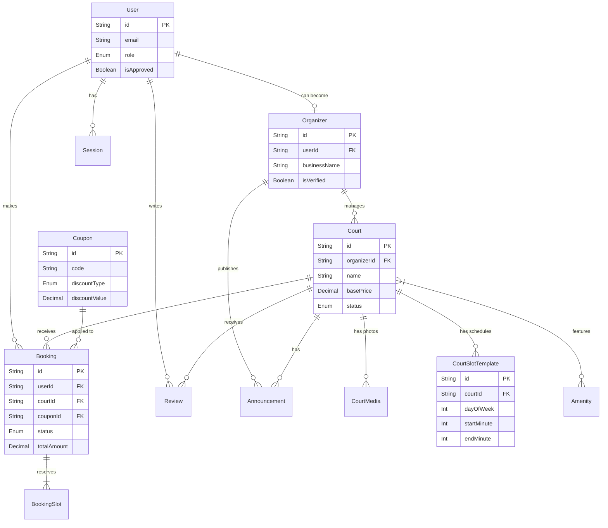
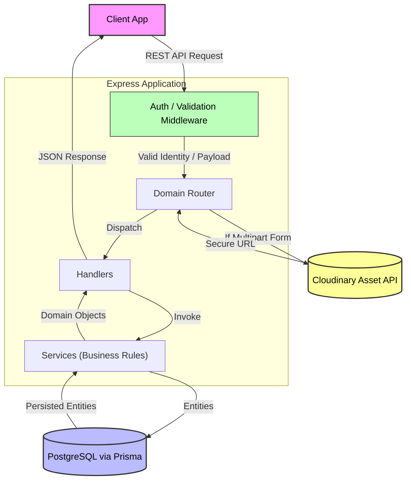

<div align="center">
  <br />
    <a href="https://github.com/Start-Impact/court-connect-backend" target="_blank">
      
    </a>
  <br />
  <br>
  <br>
  <div>
    
    
    
    
    
    
    

  </div>
<br/>
   <div style="font-size: 20px; color: #fff;"  align="center">
    Find and Book the Perfect Court for Your Next Game.
    </div>
</div>

## 📋 <a name="table">Table of Contents</a>

1. [Overview](#overview)
2. [Key Features](#features)
3. [Tech Stack](#tech-stack)
4. [Database Architecture](#database-architecture)
5. [Project Structure](#project-structure)
6. [API Documentation](#api-documentation)
7. [Quick Start](#quick-start)

## <a name="overview">Overview</a>

**Court Connect** is a robust backend system built to power a sports facility booking and management platform. It allows users to discover local courts, make bookings, and leave reviews. Facility organizers can manage their court listings, maintain scheduling, publish announcements, and track their revenue. Under the hood, it utilizes a powerful relational schema backed by PostgreSQL and Prisma to handle complex relationships between users, bookings, dynamic slots, and payments.

## <a name="features">Key Features</a>

- **🔐 Multi-Role Authentication**: Built with **Better Auth**, featuring User, Organizer, and Admin personas with approval gates.
- **🏢 Comprehensive Court Management**: Organizers can list venues, detailing amenities, pricing, geo-coordinates, and high-quality media.
- **📅 Dynamic Slot-Based Booking**: Book individual slots out of dynamically managed weekly templates, averting double-bookings.
- **🎟️ Flexible Coupon System**: Supports percentage and fixed promotions, complete with usage limits and expiry dates.
- **📢 Real-Time Announcements**: Organizers and admins can broadcast INFO, MAINTENANCE, or PROMOTION events to global or venue-specific audiences.
- **⭐ Interactive Reviews**: A nested review and reply system evaluating courts and their managing organizers.
- **☁️ Asset Management**: Full Cloudinary pipeline for avatars and court galleries.

## <a name="tech-stack">The Tech Stack</a>

| Component     | Technology                                                                                                                                                                                   | Description                                                 |
| :------------ | :------------------------------------------------------------------------------------------------------------------------------------------------------------------------------------------- | :---------------------------------------------------------- |
| **Runtime**   |                                                                                      | JavaScript runtime built on Chrome's V8 engine.             |
| **Framework** |                                                                                        | Fast, unopinionated, minimalist web framework for Node.js.  |
| **Language**  |                                                                               | Typed superset of JavaScript for better tooling and safety. |
| **Database**  |                                                                               | Powerful, open source object-relational database system.    |
| **ORM**       |                                                                                           | Next-generation ORM for Node.js and TypeScript.             |
| **Auth**      | <div style="display: flex; align-items: center; gap: 8px;"> <strong>Better Auth</strong></div> | Comprehensive authentication solution.                      |
| **Storage**   |                                                                               | Cloud-based image and video management.                     |

## <a name="database-architecture">Database Architecture</a>

The database architecture is designed specifically for slot-based reservations and venue management.



## <a name="project-structure">Project Structure</a>

The project follows a modular and domain-driven design structure.

```bash
court-connect-backend/
├── prisma/                 # Database schema and migrations
│   ├── schema/             # Sub-schemas for better organization
│   └── migrations/         # History of database changes
├── src/
│   ├── modules/            # Domain-centric logic (court, booking, etc.)
│   ├── routes/             # App routers and definitions
│   ├── middlewares/        # Global and specific route processors
│   ├── lib/                # Reusable backend functionality
│   ├── scripts/            # Setup and migration scripts
│   └── server.ts           # Primary app entry
├── .env.example            # Environment skeleton
├── package.json            # Tooling and scripts
└── tsconfig.json           # TS execution configurations
```

## <a name="api-documentation">API Documentation</a>

Explore the documented routes and requests to utilize the endpoints effectively.

👉 **[Explore Postman API / Docs](docs/API.md)**

## <a name="backend-architecture">Backend Architecture</a>

The following delineates the lifecycle of a typical inbound request:



## <a name="quick-start">Quick Start</a>

Follow these instructions to quickly instantiate a dev environment.

### Prerequisites

- **Node.js** (v18+)
- **pnpm** (recommended)
- **PostgreSQL** instance

### Installation

1. **Clone the repository**

   ```bash
   git clone https://github.com/your-username/court-connect-backend.git
   cd court-connect-backend
   ```

2. **Install dependencies**

   ```bash
   pnpm install
   ```

3. **Set up Environment Variables**

   ```bash
   cp .env.example .env
   # Add your PostgreSQL connection URI, Cloudinary secrets, Better Auth configs
   ```

4. **Database Initialization**

   ```bash
   # Generate Prisma client for modular schemas
   npx prisma generate

   # Push changes mapped by Prisma directly to PostgreSQL
   npx prisma db push
   ```

5. **Start Servers**

   ```bash
   pnpm dev
   ```

   The application typically rests at `http://localhost:5000`.

---

<div align="center">
  <br />
  <strong>Build by SAJID with ❤️</strong>
</div>
